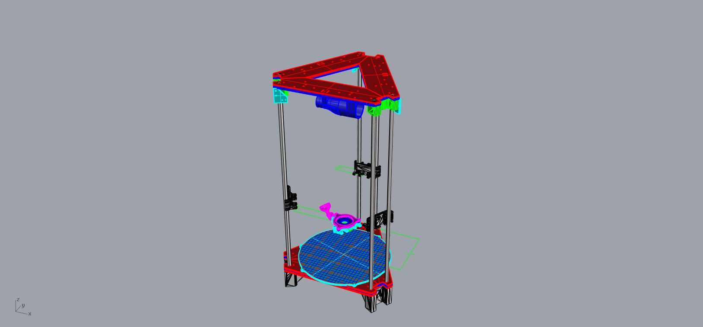
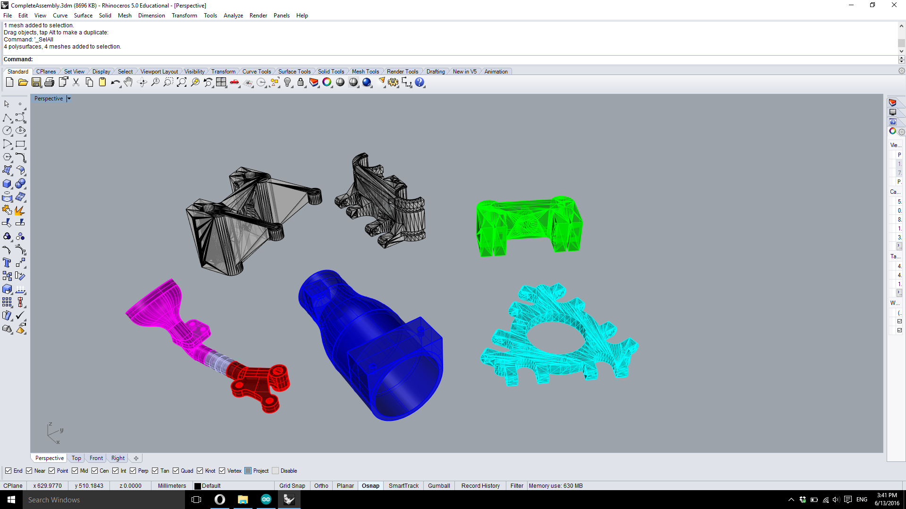
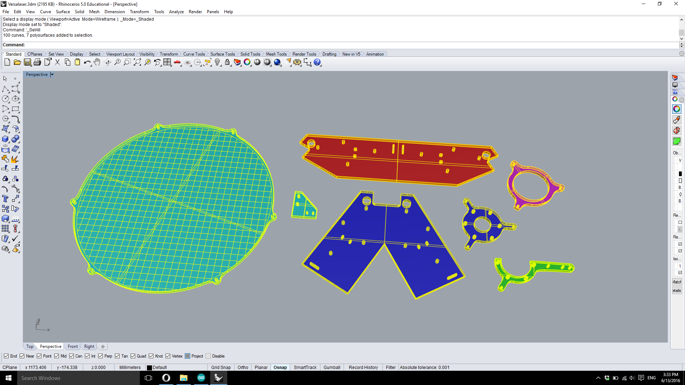
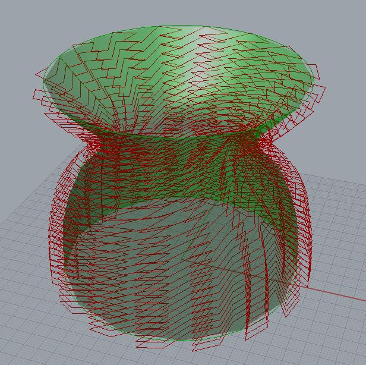

# Delta 3D Printer With Bio-Material

## Video
[](https://youtu.be/-XNRGnteBmc)

## Description
This project is the continuation of Lorizio's :  *[`https://github.com/Lorizio/Delta-3D-Printer`](https://github.com/Lorizio/Delta-3D-Printer)*.
The main goal was to improve his existing printer and to be able to print different structures with home made materials.

## Construction
### Printed pieces :
- carriage : *[`http://www.thingiverse.com/thing:80425`](http://www.thingiverse.com/thing:80425)*
- idler end : *[`http://www.thingiverse.com/thing:143186`](http://www.thingiverse.com/thing:143186)*
- motor end : *[`http://www.thingiverse.com/thing:71687`](http://www.thingiverse.com/thing:71687)*
- platform : *[`http://www.thingiverse.com/thing:32850`](http://www.thingiverse.com/thing:32850)*
- ventilation : 



### Laser-cut pieces for the frame:
- [Base assembly](hardware/baseAssembly.3dm)
- [Middle assembly](hardware/middleAssembly.3dm)
- [Top assembly](hardware/topAssembly.3dm)


### Electronics & guiding
- [See the list](hardware/partsListToBuy.odt)

## Software & programs
### Arduino board
The actual prototype uses the [Marlin Firmware](https://github.com/MarlinFirmware/Marlin) which is widely used for custom 3D printer. The specifications are located in the configuration file in the marlin folder.
Here are the important sizing values :
```
  // Center-to-center distance of the holes in the diagonal push rods.
  #define DELTA_DIAGONAL_ROD 220.0 // mm

  // Horizontal offset from middle of printer to smooth rod center.
  #define DELTA_SMOOTH_ROD_OFFSET 178.0 // mm

  // Horizontal offset of the universal joints on the end effector.
  #define DELTA_EFFECTOR_OFFSET 33.5 // mm

  // Horizontal offset of the universal joints on the carriages.
  #define DELTA_CARRIAGE_OFFSET 28.0 // mm

  // Print surface diameter/2 minus unreachable space (avoid collisions with vertical towers).
  #define DELTA_PRINTABLE_RADIUS 90.0
```

### Slicer
The slicer was implemented using [Grasshopper3D](http://www.grasshopper3d.com/) on [Rhino3D](http://www.rhino3d.com/). It generates point from (almost) any brep surface and applies different transformations to the models to print interesting structures. Main features are to add zigzags (horizontally and vertically) change the layer height and the speed.


### Printed results


### Authors
* **Philippe Heer** - *IC Master student*
* **Leonardo Wirz** - *IC Bachelor student*
* **Yuan Wang-Shih** - *Supervisor*
* **Huang Jeffrey** - *Professor*